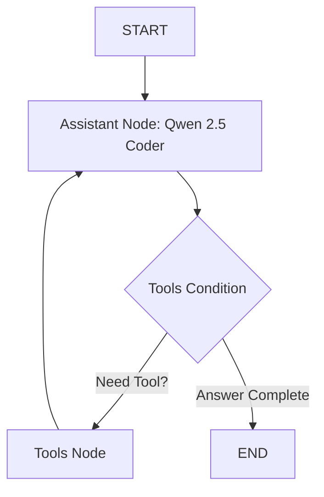

# 🎩 Alfred: The Agentic RAG Gala Host Agent

Alfred is a state-of-the-art Agentic RAG assistant designed using **LangChain** and **LangGraph** to help host a high-profile gala. Alfred is equipped with dynamic tool retrieval capabilities, enabling him to retrieve guest details, fetch real-time web news, check the weather, query Hugging Face model statistics, and maintain conversation context across multiple turns.

---

## 🚀 Key Features

* **Agentic Retrieval-Augmented Generation (RAG)**: Integrates local guest data indexed via `BM25Retriever` to fetch invitee stories and relationship details.
* **Multi-Tool Integration**:
  * 🔍 **Web Search**: Integrates `DuckDuckGoSearchRun` to look up live facts.
  * 🌤️ **Weather Checker**: Custom tool to assess weather viability for gala activities (like outdoor fireworks).
  * 📊 **Hugging Face Hub Stats**: Queries model downloads and metadata directly from the Hugging Face Hub.
* **Stateful Conversational Memory**: Preserves context dynamically across multi-turn conversations using LangGraph's state graph.
* **Robust Execution**: Native configuration to automatically resolve encoding issues on Windows (UTF-8) and suppress verbose deprecation/Hugging Face SDK warnings.

---

## 🛠️ System Architecture

Alfred's control flow is modeled as a stateful graph utilizing **LangGraph**:



---

## 📂 Project Structure

```bash
├── dataset.py        # Loads and prepares the gala invitees dataset
├── retriever.py      # Instantiates the BM25 guest retriever and guest_info_tool
├── tools.py          # Implements DDG Search, Weather Tool, and HF Hub Stats Tool
├── alfred.py         # Assembles the complete agent, integrates all tools, and runs end-to-end tests
├── .env              # Stores API credentials (git-ignored)
└── .gitignore        # Prevents committing secrets, venvs, and cache files
```

---

## ⚙️ Setup and Installation

### 1. Clone and Navigate to the Repository
```bash
git clone https://github.com/aayushkumbharkar/alfred-agentic-rag.git
cd alfred-agentic-rag
```

### 2. Configure Virtual Environment & Install Dependencies
Ensure you have Python 3.10+ installed:
```bash
python -m venv .venv
# On Windows (PowerShell):
.venv\Scripts\Activate.ps1
# On macOS/Linux:
source .venv/bin/activate

# Install required packages
pip install langchain langchain-core langchain-community langchain-huggingface langgraph python-dotenv datasets rank_bm25 ddgs
```

### 3. Add Hugging Face Hub Access Token
Create a `.env` file in the root directory:
```env
HUGGINGFACEHUB_API_TOKEN=your_huggingface_token_here
```
*(Make sure your token has **"Make calls to Inference Providers"** permissions enabled.)*

---

## 🕹️ Usage

To execute the test scenarios showcasing Alfred's capabilities end-to-end, run:

```bash
python alfred.py
```

### 🎯 Test Scenarios Run:
1. **Finding Guest Information**: Uses `guest_info_retriever` to retrieve Lady Ada Lovelace's biography and email contact details.
2. **Checking the Weather for Fireworks**: Uses `get_weather_info` to get live recommendations for organizing the outdoor fireworks display.
3. **Impressing AI Researchers**: Uses `get_hub_stats` to query the download popularity of open-source model authors (like Qwen).
4. **Combining Multiple Tools**: Runs web queries to synthesize a preparation brief for a conversation with Dr. Nikola Tesla on wireless energy.
5. **Conversation Memory**: Asks a background query about a guest and runs a follow-up query referencing the first, proving state retention.
